<div align="center">



</div>

## Quick Start

```bash
git clone https://github.com/UjjwalKumarKannojiya/ByteClaw-.git
cd ByteClaw-
bun install
bun run dev
```

## CLI

```bash
byteclaw-build wakeup
```

## Environment Variables

Create a `.env` file and add the keys used by your setup:

```env
OPENROUTER_API_KEY=
TELEGRAM_BOT_TOKEN=
TELEGRAM_CHAT_ID=
FIRECRAWL_API_KEY=
TAVILY_API_KEY=
```

---

<div align="center">
  <strong>Built for developers who want a clean AI workflow inside terminal + Telegram.</strong>
</div>
